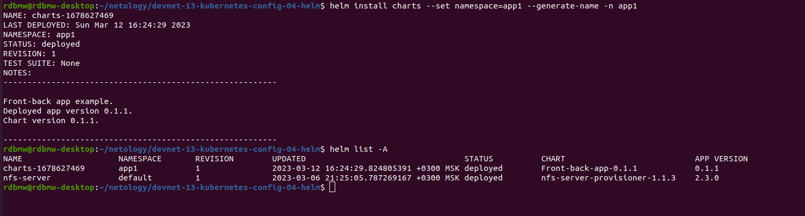
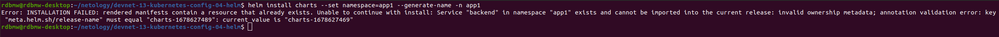
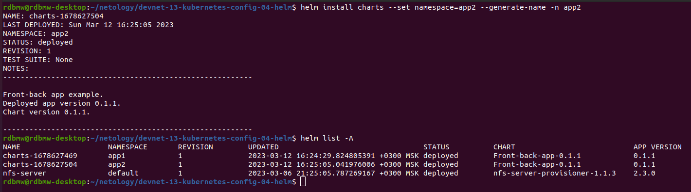

# Домашнее задание к занятию "13.4 инструменты для упрощения написания конфигурационных файлов. Helm и Jsonnet"
В работе часто приходится применять системы автоматической генерации конфигураций. Для изучения нюансов использования разных инструментов нужно попробовать упаковать приложение каждым из них.

## Задание 1: подготовить helm чарт для приложения

### Вопрос

Необходимо упаковать приложение в чарт для деплоя в разные окружения. Требования:
* каждый компонент приложения деплоится отдельным deployment’ом/statefulset’ом;
* в переменных чарта измените образ приложения для изменения версии.

### Ответ

Чарт описан в папке [charts](charts/)

## Задание 2: запустить 2 версии в разных неймспейсах

### Вопрос

Подготовив чарт, необходимо его проверить. Попробуйте запустить несколько копий приложения:
* одну версию в namespace=app1;
* вторую версию в том же неймспейсе;
* третью версию в namespace=app2.

### Ответ

Устанавливаем первую версию приложения через  ```helm install``` в неймспейс app1



Пробуем установить еще одну копию в этот же неймспейс и получаем ошибку



Установка приложения в другой namespace app2 проходит без проблем 


